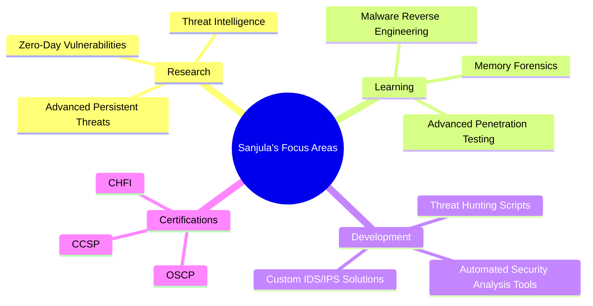

#  Sanjula Kahandawa

  
  
  

  

  
  
  
  

<!-- ANIMATED BACKGROUND SECTION -->

  

##  About Me

  

Hey there! I'm **Sanjula Kahandawa**, a passionate cybersecurity researcher with a focus on digital forensics and threat intelligence. Currently pursuing my degree in **Cybersecurity & Digital Forensics** while building on my foundation from my **Diploma in Information and Communication Technology**.

- 🛡️ Specializing in vulnerability assessment and penetration testing
- 🕵️ Fascinated by digital forensics and incident response
- 🧪 Creating tools to automate security analysis
- 🏆 Active participant in CTF competitions
- 🔭 Always exploring new security threats and defense mechanisms

  

 

> 
<i>"The only truly secure system is one that is powered off, cast in a block of concrete and sealed in a lead-lined room with armed guards."</i> — Gene Spafford

##  Tech Stack

  

  <table>
    <tr>
      <td>
        
        <h4 align="center">Python</h4>
      </td>
      <td>
        
        <h4 align="center">JavaScript</h4>
      </td>
      <td>
        
        <h4 align="center">GitHub</h4>
      </td>
      <td>
        
        <h4 align="center">VSCode</h4>
      </td>
      <td>
        
        <h4 align="center">Git</h4>
      </td>
    </tr>
  </table>

 

  
  
  
  
  
  

  
<b>🛠️ Security Tools & Platforms</b>

   
  
  

    <table>
      <tr>
        <td valign="top" width="50%">
          <h3 align="center">Security Tools</h3>
          

            
            
            
            
            
            
            
            
          

        </td>
        <td valign="top" width="50%">
          <h3 align="center">Platforms</h3>
          

            
            
            
            
            
            
            
            
          

        </td>
      </tr>
    </table>
  

<!-- ANIMATED SKILL BARS -->

  <h3>Skill Proficiency</h3>
  
  <table>
    <tr>
      <td>Python</td>
      <td>
        

          

        

      </td>
      <td>85%</td>
    </tr>
    <tr>
      <td>Bash</td>
      <td>
        

          

        

      </td>
      <td>80%</td>
    </tr>
    <tr>
      <td>OSINT</td>
      <td>
        

          

        

      </td>
      <td>90%</td>
    </tr>
    <tr>
      <td>Forensics</td>
      <td>
        

          

        

      </td>
      <td>85%</td>
    </tr>
    <tr>
      <td>Pen Testing</td>
      <td>
        

          

        

      </td>
      <td>65%</td>
    </tr>
    <tr>
      <td>Networking</td>
      <td>
        

          

        

      </td>
      <td>90%</td>
    </tr>
  </table>

##  Current Focus

  

  

##  Featured Projects

  

<!-- Project Card Container with advanced styling -->

  

    <!-- Project 1 -->
    

      <h3 style="font-size: 1.5rem; margin-bottom: 15px; color: #58a6ff;">🕸️ Network Threat Hunter</h3>
      

        
        
        
      

      
An AI-powered tool that analyzes network traffic for suspicious patterns and potential intrusions using advanced machine learning algorithms to detect zero-day threats.

      

        
        
        
        
      

    

    <!-- Project 2 -->
    

      <h3 style="font-size: 1.5rem; margin-bottom: 15px; color: #58a6ff;">🔎 Digital Forensics Swiss Army Knife</h3>
      

        
        
        
      

      
A comprehensive toolkit for digital evidence acquisition, preservation, and analysis with chain-of-custody documentation and court-ready reporting.

      

        
        
        
        
      

    

    <!-- Project 3 -->
    

      <h3 style="font-size: 1.5rem; margin-bottom: 15px; color: #58a6ff;">🦠 Malware Behavior Analyzer</h3>
      

        
        
        
      

      
A safe sandbox environment for analyzing malware behavior patterns and generating comprehensive threat intelligence reports.

      

        
        
        
        
      

    

  

##  Connect With Me

  
I'm always open to collaborating on projects and innovative ideas. Feel free to reach out to me through any of the platforms below!

  

    
    
    
    
    
  

  
  

    
    
Let's connect and create something amazing together!

  

  <!-- Animated Snake -->
  <picture>
    <source media="(prefers-color-scheme: dark)" srcset="https://raw.githubusercontent.com/platane/platane/output/github-contribution-grid-snake-dark.svg">
    <source media="(prefers-color-scheme: light)" srcset="https://raw.githubusercontent.com/platane/platane/output/github-contribution-grid-snake.svg">
    
  </picture>

---

  

  <h2>📊 GitHub Stats and Activity</h2>

  

    
    
  

  
  

  
🔐 CTF Achievements

  

    <table>
      <tr>
        <th>Competition</th>
        <th>Achievement</th>
        <th>Year</th>
      </tr>
      <tr>
        <td>HackTheBox CTF</td>
        <td>Top 5% Global Ranking</td>
        <td>2024</td>
      </tr>
      <tr>
        <td>National Cyber League</td>
        <td>Gold Division - Top 10</td>
        <td>2023</td>
      </tr>
      <tr>
        <td>SANS Holiday Hack Challenge</td>
        <td>Global Finalist</td>
        <td>2023</td>
      </tr>
      <tr>
        <td>picoCTF</td>
        <td>Top 100 Finish</td>
        <td>2022</td>
      </tr>
      <tr>
        <td>Regional Cybersecurity Challenge</td>
        <td>1st Place</td>
        <td>2022</td>
      </tr>
    </table>
  

  
🏅 Certifications

  

    <table>
      <tr>
        <th>Certification</th>
        <th>Issuing Organization</th>
        <th>Year</th>
      </tr>
      <tr>
        <td>CEH (Certified Ethical Hacker)</td>
        <td>EC-Council</td>
        <td>2023</td>
      </tr>
      <tr>
        <td>Security+</td>
        <td>CompTIA</td>
        <td>2022</td>
      </tr>
      <tr>
        <td>CCNA Security</td>
        <td>Cisco</td>
        <td>2022</td>
      </tr>
      <tr>
        <td>GCFA (GIAC Certified Forensic Analyst)</td>
        <td>GIAC</td>
        <td>2023</td>
      </tr>
    </table>
  

<!-- ANIMATED FOOTER -->

  

